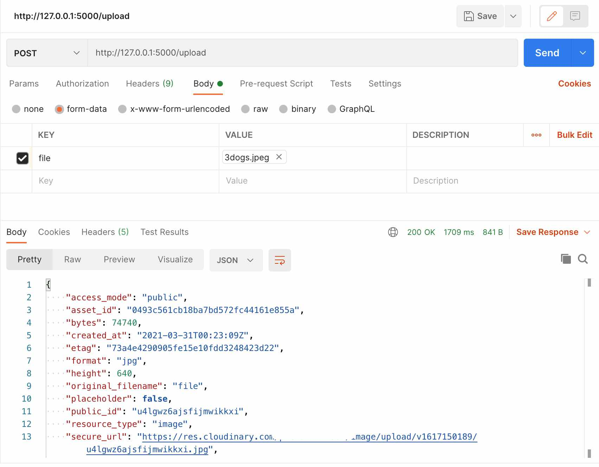
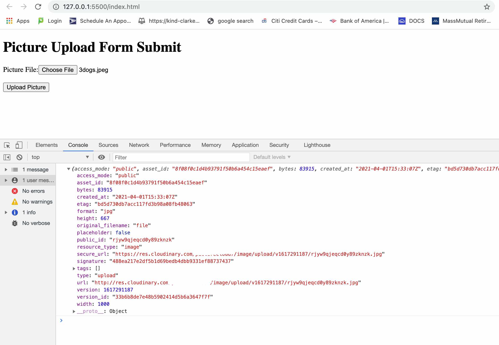

# Using Flack to Create an API Data to Cloudinary

[Code]()

## Cloudinary SDK's

Cloudinary provides SDK's for many programming languages and frameworks.  While there is an Upload API endpoint that can be used in both backend and frontend code most developers find the SDK's very helpful.

If you're working with a powerful Backend framework like Python Flask, you'll be happy to hear that there is a Python SDK that you can use.  

We're going to walk through uploading an image to Cloudinary, but the code we're creating can be easily used to upload any file type including Video, and even non-media files.

## Backend vs. Frontend Clarified

Very quickly, let's clarify the distinction between **Frontend** and **Backend**.  Generally, code that runs on the server is Backend and code that runs on the browser is Frontend.  However, since code running on the server can render  HTML, CSS and JavaScript which all run on the browser, there can be some confusion here.  In the context of the Cloudinary SDK's, Backend SDK's can read secret credentials that should not be shared in the Frontend.  Backend environment variables need never by exposed in the Frontend.  Frontend SDK's can't hide credentials that are meant to be kept secret.  Cloudinary provides **Unsigned Presets** to enable functionality like Upload in browser code without revealing secrets, but if you can write a backend API to perform your upload, you will have a secure upload without revealing your API_SECRET.  If you're using Python Flask or Python Django, you can read on to see how to do this using the Python SDK.

## Coding a Flask API to Upload to Cloudinary
The Flask framework makes it easy to define routes and their functionality.  We'll create a route named `/upload`.  This route will accept a POST containing [multipart/form-data](https://developer.mozilla.org/en-US/docs/Web/HTTP/Methods/POST). We'll package up the image file input into a FormData object in a submit handler, and POST it to our own Flack API.  Our API will call Cloudinary Upload API configured with our full set of Cloudinary credentials.  
Flask's `request` allows us to get data from the client.  When submitting files, such as uploading an image file, you can call upon the request option to access the files.  

```python
from flask import Flask,render_template, request
if request.method == 'POST':
    file_to_upload = request.files['file']
```

The data retrieved from the `request.files['file']` is an instance of **werkzeug.FileStorage**.  The object can be handed off to the Python Upload SDK function. Flask wraps [Werkzeug](https://palletsprojects.com/p/werkzeug/), using it to handle the details of WSGI (Web Server Gateway Interface).  

```python
if file_to_upload:
    upload_result = cloudinary.uploader.upload(file_to_upload)
    app.logger.info(upload_result)

```

The default upload resource_type when uploading to Cloudinary is `image`.  If we want to expand or create a new Flack API we can add `resource_type: 'video'` or `resource_type: 'raw'` if we want to upload video or raw files.  [Raw](https://cloudinary.com/documentation/upload_images#uploading_non_media_files_as_raw_files) refers to non-media file formats include text, JSON.


Finally, the `upload_result` is an object that contains the upload response.  This response can be returned to the client to complete the actions of our `upload` API.

```python
from flask import jsonify
return jsonify(upload_result)
```

The code for out `upload` API is shown below.

```python
@app.route("/upload", methods=['POST'])
def upload_file():
  app.logger.info('in upload route')

  cloudinary.config(cloud_name = os.getenv('CLOUD_NAME'), api_key=os.getenv('API_KEY'), 
    api_secret=os.getenv('API_SECRET'))
  upload_result = None
  if request.method == 'POST':
    file_to_upload = request.files['file']
    app.logger.info('%s file_to_upload', file_to_upload)
    if file_to_upload:
      upload_result = cloudinary.uploader.upload(file_to_upload)
      app.logger.info(upload_result)
      return jsonify(upload_result)
```

## Setting up the Flask App

Let's build this app now. 

### Set up virtual environment

The command below will establish our virtual environment. This is an important step so that we can encapsulate the libraries that we'll be using in this app.

```bash
python3 -m venv env
source env/bin/activate
```

You can also deactivate the environment.

```bash
deactivate
source env/bin/activate
```

### Install Flask

```bash
python3 -m pip install Flask==1.1.1
```

### Add a requirements.txt

The `requirements.txt` will keep track of all the versioned libraries needed for the app and is necessary for future deployment.

```bash
python3 -m pip freeze > requirements.txt
```
### upgrade pip if necessary

You command may vary based on your local python installation. The `freeze` will write the 

```bash
usr/local/opt/python@3.9/bin/python3.9 -m pip install --upgrade pip
python3 -m pip freeze > requirements.txt
```
### install Cloudinary 

```bash
 python3 -m pip install cloudinary
 python3 -m pip freeze > requirements.txt
 ```

 ### install Cors support
 If we want to access our `upload` API from a client that is served from a different host, we'll need to add CORS (Cross Origin Resource Sharing) support.

 ```bash
python3 -m pip install flask-cors
python3 -m pip freeze > requirements.txt
```

Now, we can add some code to configure the CORS

```python
from flask_cors import CORS, cross_origin
app = Flask(__name__)
# somewhere after creating the Flask app you can make all API's allow cross origin access.
CORS(app)
# or a specific API
@app.route("/upload", methods=['POST'])
@cross_origin()
```

### Working with Environment Variables

Python makes it easy to load environment variables.  The `python-dotenv` library is modeled on the Node.js `python-dotenv` package.  We'll need 3 environment variable from Cloudinary made available to our code: CLOUD_NAME, API_KEY, and API_SECRET.  Don't share API_SECRET.  These variables can be exported to the local environment.  When we deploy to Heroku, we'll see they have a way to add environment variables so that they are available to the app when running in a Heroku container.

```python
from dotenv import load_dotenv
load_dotenv()
```
In our `upload` API, we use the `cloudinary.config` function to read in the environment variables.  The `dotenv` library lets us use the `os.getenv` command to access them.

```python
cloudinary.config(cloud_name = os.getenv('CLOUD_NAME'), api_key=os.getenv('API_KEY'), 
    api_secret=os.getenv('API_SECRET'))
```

When working locally you can create a gitignore'd `.env` file that contains the Cloudinary credentials for local testing.  You can find the values for these credentials in your Cloudinary console.

```bash
CLOUD_NAME=CLOUD_NAME
API_KEY=API_KEY
API_SECRET=API_SECRET
```

Install the `python-dotenv` library.

```bash
python3 -m pip install python-dotenv
python3 -m pip freeze > requirements.txt
```

## Testing the API Locally 

We're now ready to test the app locally.  We can do some end to end testing using Postman and a local form pointing at a server running on localhost.

You can create your app with an upload function by downloading, cloning or copying from [this](https://github.com/rebeccapeltz/flask-cld-upload/blob/master/app.py).  Add you credentials to a `.env` file. Start your server on localhost.

```bash
python3 app.py
```

This will open a server at `http://127.0.0.1:5000/`.

### Postman

In Postman, you want to 
- Set the method to POST 
- Set the body type to `form-data`
- Establish Key/Value pairs for input.  The Key should be `file`.  You'll find that as you hover over the Key field, there is a drop down and you can select **Text** or **File**. Select File and then you'll see a **Select Files** button and you can select a file from your local drive  
- Now press Send to process the request
- You'll see the Cloudinary Upload API response in the in the Body result at the bottom of the page.



### Local Form

Open the `index.html` using a local HTTP server.  Choose a local file and press upload.

The `fetch` command will call the server running on localhost.  If it's successful, you'll see the Cloudinary Upload API response in the console. 

```JavaScript
 fetch("http://127.0.0.1:5000/upload", options)
  .then((response) => {
    return response.json();
  })
  .then((data) => {
    console.log(data);
  })
  .catch((error) => {
    console.log(error);
  });
```
Don't forget to ` event.preventDefault();` when using a submit handler or you'll get a page refresh, and won't see your log.

To post a file in a submit handler, you'll need to create a FormData object and append the file as shown in the code below.

```JavaScript
const formData = new FormData();
formData.append("file", fileInput.files[0]);
const options = {
  method: "POST",
  body: formData,
};
```
This will package up the file you select in your form input as if you had submitted a multi/part-form.  When submitting files, you want to use multi/part a form because each input is sent as a block of data separated by boundaries.  

You should observe a result like this in your console.




## Deploying the Flask App to Heroku

Heroku is a PAAS (Platform as a Service) that can be used for serving prototypes or production ready applications.  We'll use it to host the API we've developed here. 

Start by creating a free account on Heroku.


## Test the API deployed on Heroku


